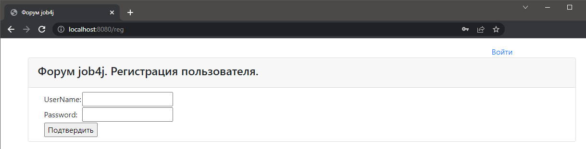
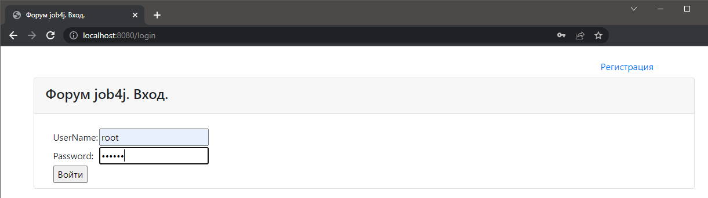
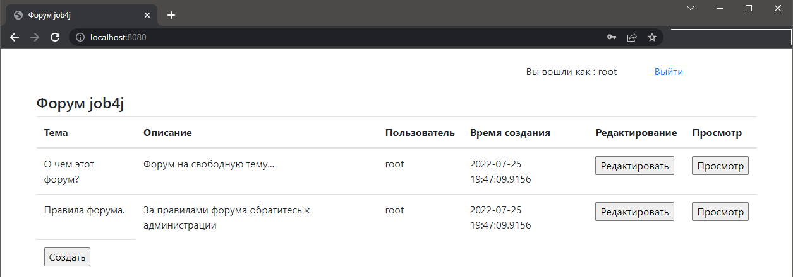
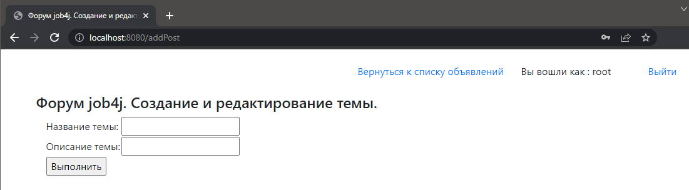
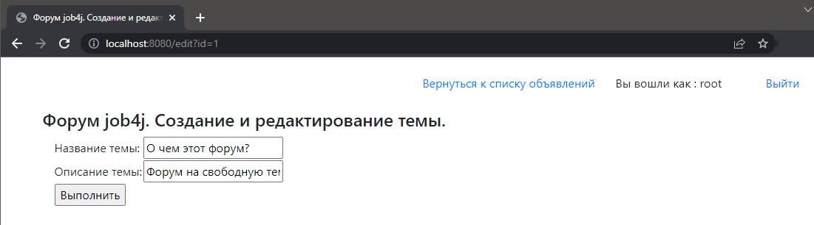
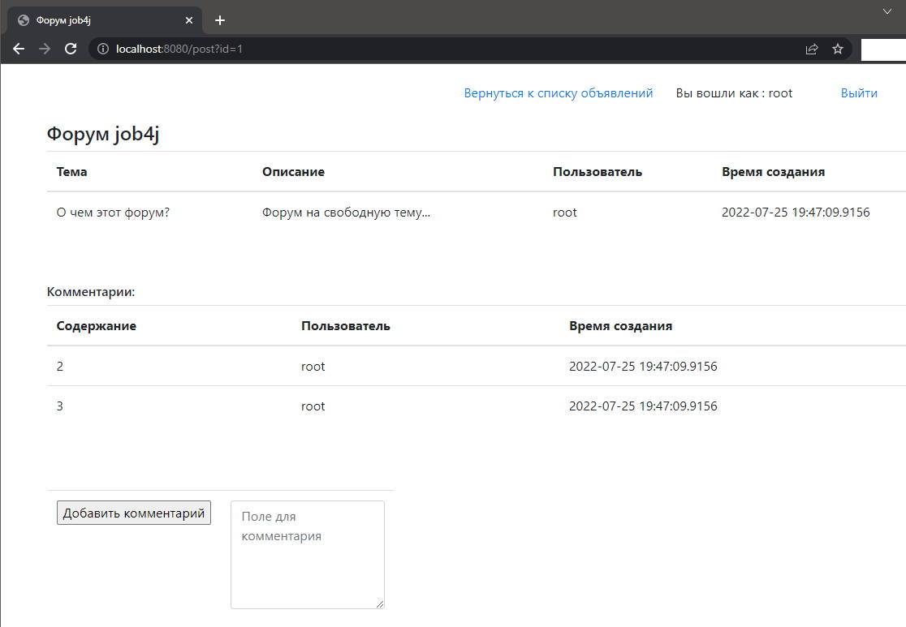
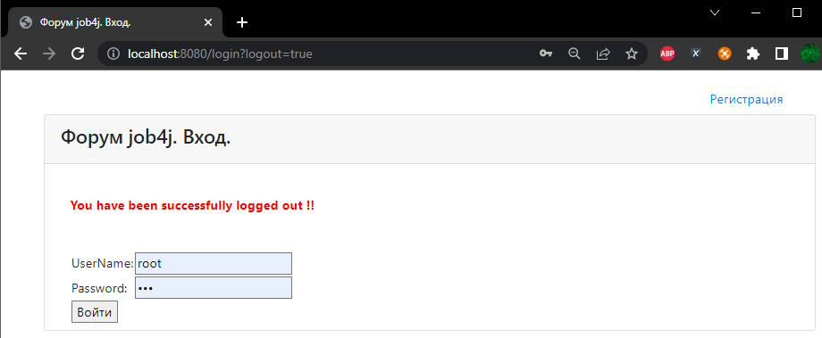

# Forum

## 
Оглавление

<ul>
<li><a href="#01">Описание проекта</a></li>
<li><a href="#02">Стек технологий</a></li>
<li><a href="#03">Требования к окружению</a></li>
<li><a href="#04">Сборка и запуск проекта</a>
    <ol type="1">
        <li><a href="#0401">Сборка проекта</a></li>
        <li><a href="#0402">Запуск проекта</a></li>
    </ol>
</li>
<li><a href="#05">Взаимодействие с приложением</a>
    <ol  type="1">
        <li><a href="#0501">Страница регистрации</a></li>
        <li><a href="#0502">Страница входа</a></li>
        <li><a href="#0503">Список всех тем</a></li>
        <li><a href="#0504">Страница создания и редактирования темы</a></li>
        <li><a href="#0505">Просмотр конкретной темы</a></li>
        <li><a href="#0506">Выход из приложения</a></li>
    </ol>
</li>
<li><a href="#todo">TODO list</a></li>
<li><a href="#contacts">Контакты</a></li>
</ul>

## 
Описание проекта

Веб приложение, реализующее функционал простого форума.

Функционал:

* Регистрация пользователей, аутентификация и
  авторизация с использованием Spring Security.
* Добавление тем форума и комментариев.
* По каждой теме форума учитывается: пользователь, дата создания.
* Возможность отображения всех тем плюс комментарии.

<a href="#contents">К оглавлению</a>

## 
Стек технологий

- Java 14
- HTML, Bootstrap 4, JSP + JSTL
- Spring Boot 2.7, Spring MVC, Spring Security, Spring Data
- PostgreSQL 14, Liquibase 4
- JUnit 4, Mockito
- Lombok
- Maven 3.8

Инструменты:
- Javadoc, JaCoCo, Checkstyle

<a href="#contents">К оглавлению</a>

## 
Требования к окружению

Java 14, Maven 3.8, PostgreSQL 14

<a href="#contents">К оглавлению</a>

## 
Сборка и запуск проекта

Для выполнения действий данного раздела необходимо установить
и настроить систему сборки проектов Maven.
По умолчании проект компилируется и собирается в директорию target.

<a href="#contents">К оглавлению</a>

### 
1. Сборка проекта

Команда для сборки в war
`mvn clean package -DskipTests`

<a href="#contents">К оглавлению</a>

### 
2. Запуск проекта

Команда для запуска
`mvn spring-boot:run`

<a href="#contents">К оглавлению</a>

## 
Взаимодействие с приложением

### 
1. Страница регистрации

Каждому пользователю присваивается: имя пользователя и пароль.

<a href="#contents">К оглавлению</a>

### 
2. Страница входа

Для входа необходимо ввести пароль и имя пользователя.

<a href="#contents">К оглавлению</a>

### 
3. Список всех тем

На странице выводится список всех тем пользователей сайта.

<a href="#contents">К оглавлению</a>

### 
4. Страница создания и редактирования темы

На странице задается название темы и описание темы, либо редактируется.

<a href="#contents">К оглавлению</a>

### 
5. Просмотр конкретной темы

На странице выводится тема и список комментариев.
Возможно добавление нового комментария.

<a href="#contents">К оглавлению</a>

### 
6. Выход из приложения

При нажатии в панели навигации на ссылку "Выйти", происходит
выход пользователя из приложения с перенаправлением на страницу входа и
сообщением о том, что пользователь вышел.

<a href="#contents">К оглавлению</a>

## 
TODO list

* Добавить JavaDoc
* Добавить страницу вывода моих тем
* Добавить возможность удаления тем

<a href="#contents">К оглавлению</a>

## 
Контакты

&nbsp;&nbsp;
&nbsp;&nbsp;

<a href="#contents">К оглавлению</a>
